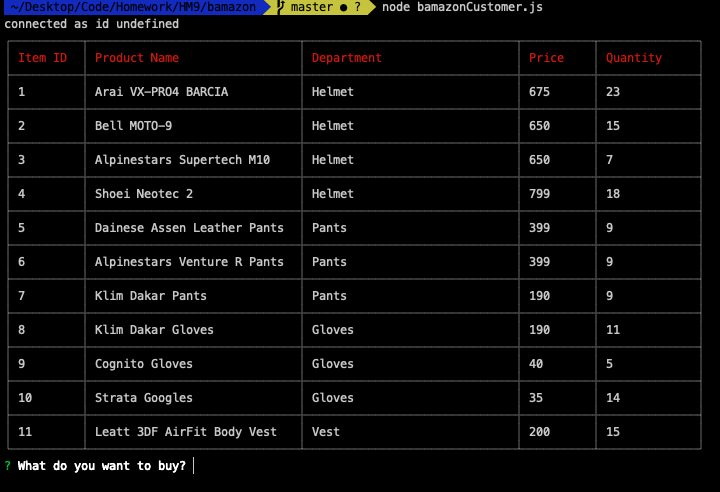
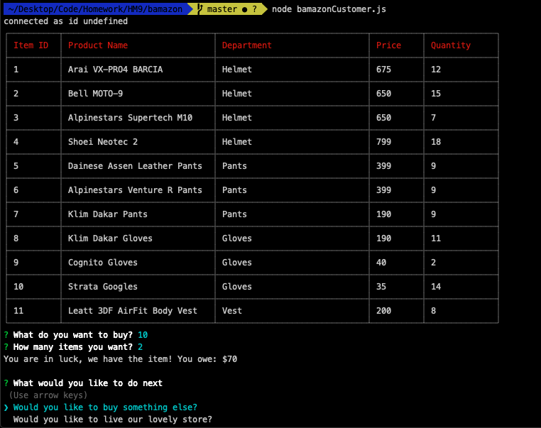
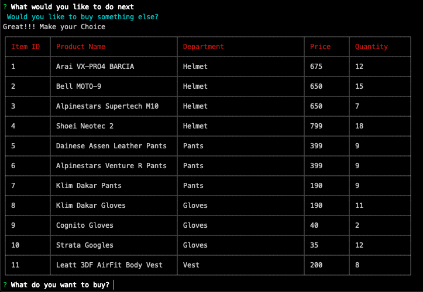
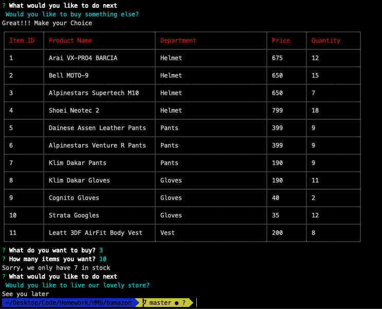
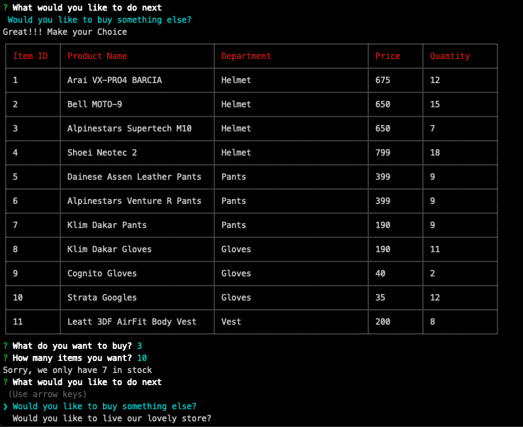

# Bamazon! 

## About

Within the customer portal, on the first page load the user can the full inventory currently on hand at the store. Further, through command line the user can select the item they are interested. Then the user can select the quantity they would like to purchase.  

Once the item and the quantity has been selected, the app will check the quantity requested against the quantity on hand. Next, the app will check if the items on hand can cover the order. The user then will be notified either if the transaction was successful. 
Transaction complete!

## Getting Started
1. Clone the repository 
<pre>git clone git@github.com:jjeskovs/Bamazon.git</pre>

2. Install Node.js
3. Install all the dependency by running the 
<pre>npm install</pre>

4. Seed MySQL database 

## Running Bamazon from the CLI

<pre>
node bamazonCustomer.js 
</pre>

**Home Screen with the list of current items on hand.**

**Placing the order, by selecting unique ID of the item and the quantity desired.**

**The app calculates the total for the purchase, and asks what step the user would like to do next, buy additional items or leave the store.**

Additional item:

Leave the store:

**If the store cannot cover the order with the inventory on hand.**

### Technology used:

* JavaScript
* Node.JS
* Inquirer.JS
* MySQL

## Future Development
Manager portal **STILL UNDER DEVELOPMENT**
Within the manager portal, the following items will be available:

* View all the inventory in the store 
* View all low inventory (less than 5 items on hand)
* Add new Item to inventory 
* Delete items from inventory listing